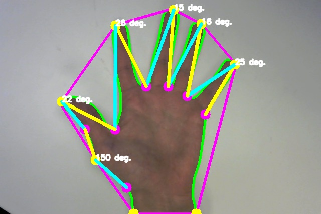

# Repo-Robot

Robotics project at CU. Using ArcBotics Sparki robot, we are repoing toy cars that haven't payed for parking.

## Steps of our calculations

**Step 1**

**Step 2**

**Step 3**

**Step 4**

**Step 5**

**Step 6**

**Step 7**

**Step 8**

**Step 9**

